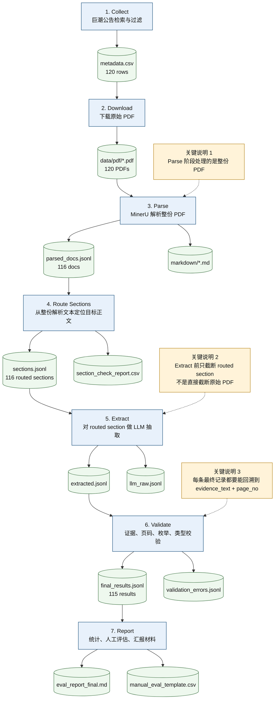

# Pipeline 流程图与标注说明

## 1. 当前稳定版样本规模

- `metadata.csv`：120 条公告元数据
- `data/pdf/`：120 份原始 PDF
- `parsed_docs.jsonl`：116 份 MinerU 成功解析结果
- `sections.jsonl`：116 条 section routing 结果
- `final_results.jsonl`：115 条最终结构化结果
- `extract_errors.jsonl`：1 条远端 LLM API 500 失败记录

## 2. 总体流程图

## 3. 每一步具体做什么

### Step 1. Collect：元数据采集与过滤

- 输入：巨潮公告检索接口 `https://www.cninfo.com.cn/new/hisAnnouncement/query`
- 作用：先拿到候选公告清单，而不是直接下载所有检索结果
- 核心过滤规则：
  - 关键词分组：`attention / inquiry / reply / regulatory_measure`
  - 排除词：如 `募集说明书`、`法律意见书`、`摘要`、`英文版`
  - 优先级：`regulatory_measure > reply > attention_letter > inquiry_letter > other`
  - 去重：先按 `doc_id`，再按 `pdf_url`
- 输出：`data/metadata/metadata.csv`
- 目的：把“真正和监管问询/关注/回复/监管措施有关”的公告筛出来，减少无关样本进入后续流程

### Step 2. Download：下载原始 PDF

- 输入：`metadata.csv` 中的 `pdf_url`
- 作用：把每条公告的原始 PDF 本地化，形成可复查的原始数据层
- 额外控制：
  - 域名白名单检查
  - 下载失败要记录日志
- 输出：`data/pdf/*.pdf`
- 目的：保证后面所有抽取结果都能回溯到原始公告文件

### Step 3. Parse：MinerU 解析整份 PDF

- 输入：原始 PDF
- 作用：调用 MinerU API，把 PDF 解析成带页码信息的文本/Markdown
- 这里处理的是：
  - **整份 PDF**
  - **不是只取前几页**
- 强约束：
  - 必须使用 MinerU API
  - 没有 `MINERU_API_KEY` 或解析失败不能静默 fallback
- 输出：
  - `data/parsed/parsed_docs.jsonl`
  - `data/parsed/markdown/*.md`
- 目的：先完整保留全文解析结果，后面 section routing 才有机会在整份文档中找到真正相关的正文

### Step 4. Route Sections：目标正文定位

- 输入：整份解析文本 `parsed_docs.jsonl`
- 作用：从整份公告里定位“最可能包含监管对象、问题点、监管动作”的正文片段
- 主要规则来自 `configs/section_rules.yaml`

#### 4.1 include_regex 是什么

- `include_regex` 是“主题相关命中词”
- 作用：判断某一页或某一段是否大概率属于我们要找的公告正文
- 例如：
  - 问询/关注/回复类：`关注函`、`问询函`、`回复`、`回函`、`延期回复`
  - 监管措施类：`行政监管措施`、`警示函`、`责令改正`、`整改报告`

#### 4.2 anchor_regex 是什么

- `anchor_regex` 是“更强的正文锚点词”
- 它不是简单说明“这篇文档相关”，而是尽量定位“正文从哪里开始最值得抽”
- 例如：
  - `现回复如下`
  - `经查`
  - `存在以下问题`
  - `决定对`
  - `一、二、三`
  - `问题一 / 问题二`
- routing 时会优先使用 `anchor_regex`，找不到再退回 `include_regex`

#### 4.3 exclude_regex 是什么

- `exclude_regex` 是“应跳过的噪声页”
- 当前主要排除：
  - `目录`
  - `声明`
  - `释义`
  - `重要提示`
  - `摘要`
- 目的：避免把封面、目录、声明页当成正文命中

#### 4.4 page_expansion 是什么

- routing 命中锚点页以后，不会只取单页
- 会向前/向后扩一部分页数，把上下文一起保留
- 当前典型逻辑：
  - 问询/回复类：向前扩 2 页，向后扩 1 页
  - 监管措施类：向前扩 1 页，向后扩 1 页
- 目的：有些关键信息分布在前后相邻页，比如：
  - 第 1 页点出监管机关
  - 第 2 页列问题
  - 第 3 页写整改要求

#### 4.5 max_pages / max_span_pages / min_chars 是什么

- `max_span_pages`：防止一次命中过宽，直接把一大段无关内容全带进去
- `max_pages`：限制最终 section 的最大页数
- `min_chars`：如果抽出来太短，说明可能不是有效正文，要标成 `too_short`

#### 4.6 这一步的输出是什么

- `data/parsed/sections.jsonl`
  - 每份公告只保留 **1 条最终选中的 routed section**
  - 内部会插入 `[Page N]` 标记
- `outputs/reports/section_check_report.csv`
  - 记录每次路由尝试是否命中、命中的 section 类型、页码范围、质量问题

### Step 5. Extract：对 routed section 做结构化抽取

- 输入：`sections.jsonl`
- 作用：把目标正文抽成结构化字段
- 抽取字段包括：
  - 顶层字段：`doc_id`、`stock_code`、`stock_name`、`market`、`publish_date`、`announcement_title`、`doc_type`
  - `regulator_name`
  - `targets[]`
  - `issues[]`
  - `actions[]`

#### 5.1 这里不是“直接取 PDF 前几页”

- 真正的处理顺序是：
  1. 完整下载 PDF
  2. 完整解析整份 PDF
  3. 从整份文本中 route 出最相关 section
  4. **只在 extract 前，对这个 routed section 做截断**

#### 5.2 为什么要截断

- routed section 可能仍然比较长
- 如果直接把全部 section 都送给 LLM：
  - 耗时更长
  - 更容易超时
  - 成本更高
- 所以当前代码在 `src/extractor.py` 中做了两层限制：
  - 最多保留前 `5` 个 page block
  - 最多保留 `20000` 字符

#### 5.3 为什么这个截断通常是合理的

- 因为 section routing 已经尽量把正文入口对准：
  - `现回复如下`
  - `经查`
  - `存在以下问题`
  - `决定对`
  - `问题一/问题二`
  - `一、二、三`
- 监管对象、问题点、监管要求/整改动作通常集中出现在这些锚点附近
- 所以这里是“先精确定位，再有限截断”，而不是“粗暴截断 PDF 前几页”

### Step 6. Validate：结果校验与修正

- 输入：`extracted.jsonl`
- 作用：不是再抽一次，而是检查抽取结果是否满足项目规则

#### 6.1 evidence 校验

- 每个非空关键字段都应带 `evidence`
- `evidence.evidence_text` 必须是 routed `section_text` 的原文子串
- 如果不是原文子串，说明存在幻觉风险，不能直接保留

#### 6.2 page_no 校验

- `page_no` 必须能和 section 内的 `[Page N]` 标记对应
- 如果页码超出范围或不可信，会被修成 `null`

#### 6.3 枚举校验

- 以下字段只能取白名单值：
  - `doc_type`
  - `target_type`
  - `issue_type`
  - `action_type`
  - `action_source_type`
- 目的：保证统计结果可比较，不会出现大量近义词碎片化

#### 6.4 类型校验与规则修正

- 检查布尔字段类型是否正确
- 某些 `action_type` 会根据证据关键词做规则修正，例如：
  - `警示函 -> warning_letter`
  - `监管谈话 -> supervisory_talk`
  - `责令改正 -> order_correction`
  - `书面报告 -> written_report_required`
  - `整改 -> rectification_required`
- `deadline` 如果证据中没有明确期限表达，会被清空为 `null`

#### 6.5 输出是什么

- `outputs/results/final_results.jsonl`
- `outputs/logs/validation_errors.jsonl`

### Step 7. Report：评估与汇报

- 输入：`final_results.jsonl`、`section_check_report.csv`、人工评估结果
- 输出：
  - `eval_report_final.md`
  - `manual_eval_template.csv`
  - 汇报材料与 demo
- 作用：把模型运行结果转成可解释、可答辩的项目结论

## 4. 关键字段含义

### 顶层字段

- `doc_id`：公告主键，对应巨潮 `announcementId`
- `stock_code`：证券代码
- `stock_name`：证券简称
- `market`：市场，当前主要是 `sse / szse`
- `publish_date`：公告发布日期
- `announcement_title`：公告标题
- `doc_type`：公告类型
  - `attention_letter`
  - `inquiry_letter`
  - `regulatory_measure`
  - `reply`
  - `other`

### regulator_name

- 监管机关名称
- 例如交易所、地方证监局等
- 如果公告里没有明确写出，就必须为 `null`

### targets[]

- 抽取监管对象
- 每一项包括：
  - `name`
  - `role`
  - `target_type`
  - `evidence`

### issues[]

- 抽取问题点
- 每一项包括：
  - `issue_type`
  - `issue_summary`
  - `is_violation_related`
  - `evidence`

### actions[]

- 抽取监管要求或公司整改/承诺动作
- 每一项包括：
  - `action_type`
  - `action_source_type`
  - `deadline`
  - `required_disclosure`
  - `evidence`

## 5. 当前这套流程的核心逻辑

这套 pipeline 的本质不是“让 LLM 读整份 PDF 直接输出结论”，而是分成 3 层：

1. **数据层**：collect / download / parse  
   先保证原始数据真实、可追溯、可复查。

2. **定位层**：route sections  
   先从整份文档中缩小到最相关正文，减少噪声和成本。

3. **抽取校验层**：extract / validate / report  
   先抽，再用规则和证据链把结果卡住，避免直接相信 LLM 输出。

## 6. 汇报时最值得强调的三句话

1. 本项目不是“直接读整份 PDF 让模型猜答案”，而是“整份 PDF 先解析，再做 section routing，再在局部正文里抽取”。
2. 本项目不是“只看原始 PDF 前几页”，而是“先定位正文，再只截断 routed section 的前 5 个 page block 和 20000 字符，用于控制超时与成本”。
3. 最终结果不是 LLM 原始输出，而是经过 validator 做 `evidence_text`、`page_no`、枚举合法性和字段类型校验后的结果。
